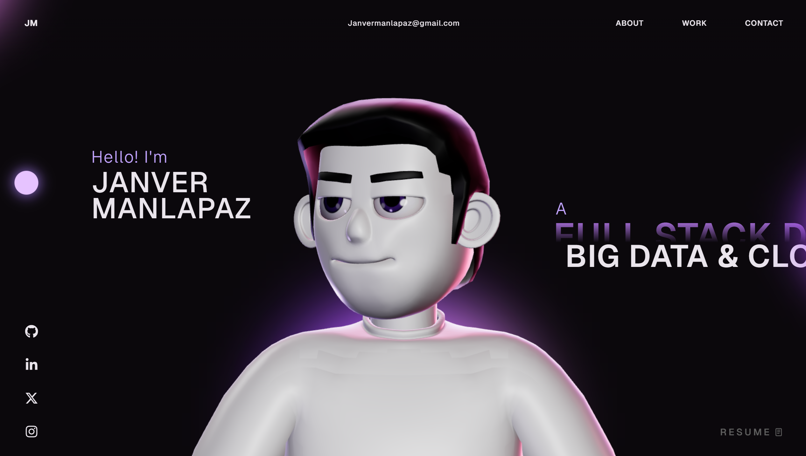

# 🚀 Janver Manlapaz - Developer Portfolio



A modern, high-performance **3D developer portfolio website** built with **React**, **TypeScript**, **Three.js**, **GSAP**, and **WebGL**.

## 👨‍💻 About Me

I am Janver Manlapaz, a third-year Computer Engineering student and Full-Stack Developer specializing in front-end and back-end web application development. I have a strong focus on architecting scalable SaaS products and robust, data-driven systems.

## ✨ Highlights

- **3D / WebGL experience** powered by **Three.js**
- Smooth animations with **GSAP**
- Modern **React + TypeScript** codebase
- Integrated **AI Chat System** powered by Groq LLaMA 3
- Fast, responsive UI (desktop + mobile)

## 🧰 Tech Stack

- **React** & **Next.js**
- **TypeScript** & **JavaScript**
- **Three.js / WebGL** & **GSAP**
- **Node.js** & **Express**
- **Prisma**, **PostgreSQL**, **MongoDB**
- **Tailwind CSS**

## 🚀 Getting Started

To run this project locally:

### 1) Clone

```bash
git clone https://github.com/janveryuu/Janver-Manlapaz---Portfolio.git
cd Janver-Manlapaz---Portfolio
```

### 2) Install Dependencies

```bash
npm install
```

### 3) Set Up Environment

Create a `.env` file in the root directory and add your Groq API key (used for the AI Chat feature):

```env
GROQ_API_KEY=your_api_key_here
```

### 4) Run Locally

Since this project uses Vercel Serverless Functions (`api/chat.js`), use the Vercel CLI to run it locally:

```bash
npx vercel dev
```

## 🤝 Connect

- **LinkedIn:** [Janver Manlapaz](https://www.linkedin.com/in/janver-manlapaz-1817aa419/)
- **GitHub:** [@janveryuu](https://github.com/janveryuu)
- **Email:** Janvermanlapaz@gmail.com

## 🪪 License

This project is available under the **MIT License**.
