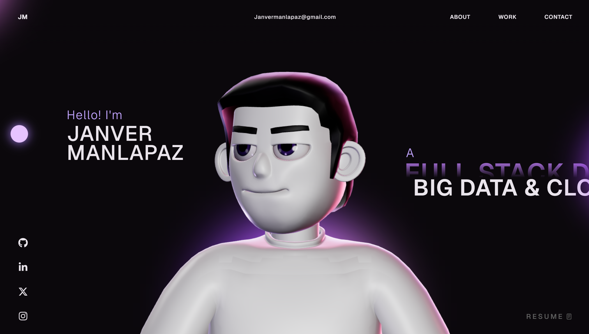

<div align="center">

# 🚀 Janver Manlapaz — Developer Portfolio

[](https://janver-manlapaz-portfolio.vercel.app/)
[](https://react.dev/)
[](https://www.typescriptlang.org/)
[](https://vitejs.dev/)
[](https://threejs.org/)
[](https://greensock.com/)

<br />



<p align="center">
  A modern, high-performance <b>3D interactive developer portfolio</b> showcasing full-stack engineering, AI systems integration, and web design excellence.
</p>

</div>

---

## 👨‍💻 About Me

I am **Janver Manlapaz**, a Computer Engineering student, Full-Stack Developer, and AI Engineer specializing in end-to-end web applications, intelligent LLM-powered systems, and immersive web experiences.

* 🌐 **Live Website:** [https://janver-manlapaz-portfolio.vercel.app/](https://janver-manlapaz-portfolio.vercel.app/)
* 📧 **Contact:** [Janvermanlapaz@gmail.com](mailto:Janvermanlapaz@gmail.com)
* 💼 **LinkedIn:** [Janver Manlapaz](https://www.linkedin.com/in/janver-manlapaz-1817aa419/)

---

## ✨ Key Features & Highlights

- 🎭 **Interactive 3D Experience:** Real-time WebGL canvas and 3D character tracking cursor movement powered by **Three.js**.
- 📜 **Dual-Direction Horizontal Pin-Scrolling:** GSAP ScrollTrigger galleries with staggered card layouts for **Featured Work** and **Certifications** (with fullscreen high-res inspection modal).
- 🤖 **Interactive AI Playground (`/play`):** Fully playable Chess game paired with a personalized AI personality clone powered by **Groq LLaMA 3.3** via Vercel Serverless Functions.
- 📐 **Obsidian Blueprint Design System:** Sleek dark aesthetic with custom typography, glowing accent tokens, and dashed blueprint cards.
- ⚡ **Optimized Performance:** WebP compressed assets (< 200KB), automated WebGL render pausing when off-screen, and smooth responsive touch scrolling for mobile devices.

---

## 🗂️ Project Directory Structure

```text
├── api/                  # Vercel serverless functions (Groq LLaMA 3.3 chatbot API)
├── certificates/         # Source high-resolution certificate design assets
├── docs/                 # Handoff guides & feature documentation
│   ├── MOBILE-CONTEXT.md # Context & design tokens for mobile UI redesign
│   └── CERTIFICATIONS-PROMPT.md
├── public/               # Static web assets, 3D models, WebP certificates, and icons
│   ├── draco/            # Three.js Draco 3D mesh decoders
│   ├── images/           # Optimized project previews, logos & certificates
│   ├── models/           # 3D character models and environment HDR maps
│   └── video/            # Background video loops
├── src/                  # Application source code
│   ├── assets/           # Internal graphic assets
│   ├── components/       # Core UI sections (Landing, Work, Certifications, WhatIDo, etc.)
│   │   ├── Character/    # Three.js 3D character scene & animation hooks
│   │   ├── styles/       # Modular CSS stylesheets per component
│   │   └── utils/        # GSAP animations, split-text, and scroll utilities
│   ├── context/          # React context providers (LoadingProvider)
│   ├── data/             # 3D rigging and static data models
│   ├── pages/            # Multi-route views (Play.tsx / MyWorks.tsx)
│   ├── utils/            # Redox chess engine and text helpers
│   ├── config.ts         # Centralized portfolio data (Projects, Certs, Skills, Experience)
│   ├── App.tsx           # Router and main layout definition
│   ├── index.css         # Global CSS variables, resets, and tokens
│   └── main.tsx          # React application entry point
├── index.html            # HTML entry point & SEO meta tags
├── package.json          # Project dependencies & scripts
├── vite.config.ts        # Vite configuration & production chunk splitting
└── vercel.json           # Vercel deployment routing & API rewrites
```

---

## 🛠️ Tech Stack & Tooling

| Domain | Technologies |
| :--- | :--- |
| **Front-End Framework** | React 18, TypeScript, Vite 5 |
| **3D & Graphics** | Three.js, WebGL, React Three Fiber / Drei, Draco Compression |
| **Animation Engine** | GSAP 3 (ScrollTrigger, SplitText), Canvas Loops |
| **AI & Backend** | Groq Cloud (LLaMA 3.3-70B), Vercel Serverless Functions |
| **Styling & Design** | Vanilla CSS, CSS Modules, Modern CSS Tokens |
| **Deployment** | Vercel (CI/CD with automatic branch previews) |

---

## 🚀 Getting Started

### 1. Clone the Repository
```bash
git clone https://github.com/janveryuu/JanverManlapaz-Portfolio.git
cd JanverManlapaz-Portfolio
```

### 2. Install Dependencies
```bash
npm install
```

### 3. Configure Environment Variables
Create a `.env` file in the root directory:
```env
GROQ_API_KEY=your_groq_api_key_here
```

### 4. Run Development Server
```bash
npm run dev
```

For full serverless API testing (`api/chat.js`):
```bash
npx vercel dev
```

### 5. Build for Production
```bash
npm run build
```

---

## 📄 License

This project is licensed under the [MIT License](LICENSE).
